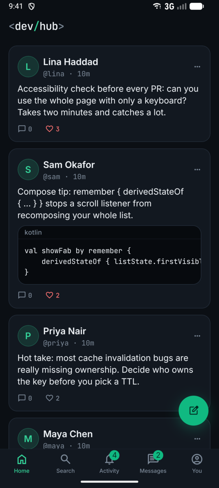
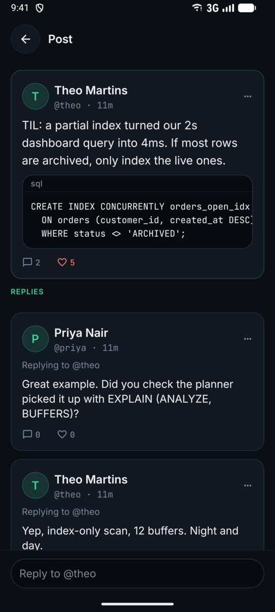
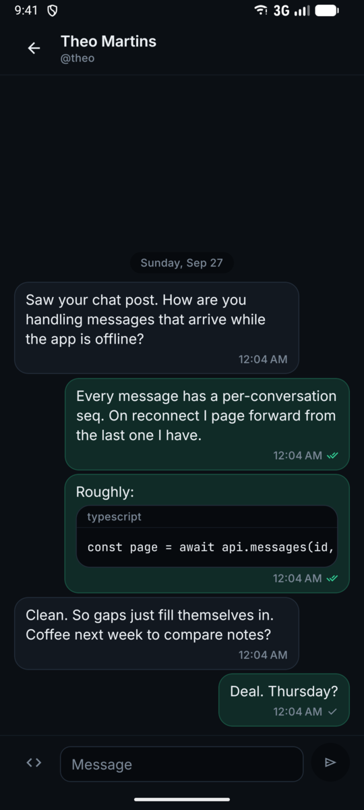
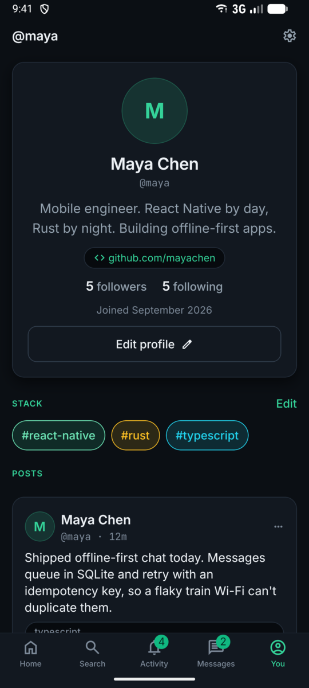

<p align="center">
  
</p>

<h1 align="center">DevHub</h1>

<p align="center">
  <b>A social network for developers.</b> Share posts with real code, follow people who work
  on what you work on, and chat in real time. Built with Expo and React Native.
</p>

<p align="center">
  <a href="https://github.com/GitSter-dev/devhub-app/releases/latest"></a>
  <a href="https://github.com/GitSter-dev/devhub-app/actions/workflows/test.yml"></a>
  
  
  
</p>

<p align="center">
  Part of DevHub: <b>Mobile app</b> · <a href="https://github.com/GitSter-dev/devhub-backend">Backend</a> · <a href="https://github.com/GitSter-dev/devhub-console">Moderator console</a>
</p>

<p align="center">
  
  
  
  
</p>

## What it does

- **Onboarding that sets you up.** Pick your stack and topics, then follow suggested people so
  your feed isn't empty on day one.
- **A feed made for code.** Write posts with code blocks and topic tags, reply in threads, like
  and follow.
- **Realtime chat.** Direct and group conversations with typing indicators, delivered/read ticks,
  replies and message requests from people you don't follow yet.
- **Notifications.** In-app and push. Tapping one opens the right screen.
- **Safety built in.** Block people, report posts and users. Reports go to the
  [moderation console](https://github.com/GitSter-dev/devhub-console).
- **Light and dark themes**, haptics and native-feeling motion.

## Engineering highlights

- **Chat that works on bad networks.** Outgoing messages go to a local SQLite outbox first and are
  retried with backoff using idempotency keys, so a message is never lost or sent twice. After a
  reconnect, the app fetches the messages it missed by sequence number.
- **Instant likes and follows.** The UI updates immediately. Rapid taps are merged into one request,
  and failures retry quietly, respecting the server's `Retry-After`.
- **A careful retry policy.** Reads retry automatically. A `POST` is only repeated when it carries an
  idempotency key, so a flaky connection can't create duplicate posts.
- **A resilient live connection.** The WebSocket reconnects with jittered backoff and reacts to the
  phone going offline or coming back.
- **A custom design system and state layer.** Themed components and a small typed store, with no
  Redux. The React Compiler and typed routes are enabled.
- **A trustworthy release pipeline.** Pushing a version tag builds a signed APK. CI checks the
  signing certificate and the backend the build points at before publishing it.

## Tech stack

| Area | Choices |
|---|---|
| App | Expo SDK 57, React Native 0.86, React 19, TypeScript, Expo Router (typed routes) |
| Data | TanStack Query, ky, zod, react-hook-form |
| Realtime & storage | STOMP over WebSocket, expo-sqlite, expo-secure-store |
| UI | Reanimated 4, Gesture Handler, expo-image, custom design system |
| Push | expo-notifications with Firebase Cloud Messaging |
| Quality | Vitest, Testing Library, MSW, ESLint, GitHub Actions |

## Run it locally

You need Node 24, pnpm and an Android emulator or device. The app talks to the
[DevHub backend](https://github.com/GitSter-dev/devhub-backend), which you can run locally.

```bash
pnpm install
cp .env.example .env.local   # point EXPO_PUBLIC_API_URL at your backend
pnpm android                 # builds the dev client and launches it
```

## Testing & delivery

- **272 tests** in two suites: fast unit tests for the sync, retry and chat logic, and screen tests
  that render real screens against a mocked API (MSW). Run them with `pnpm test`.
- Every push and pull request runs lint, the type-checker and the tests.
- Tagging `vX.Y.Z` runs the tests, builds and verifies a signed APK, and publishes it to
  [Releases](https://github.com/GitSter-dev/devhub-app/releases).

---

© 2026 [GProgrammer1](https://github.com/GProgrammer1). The source is public for review but not licensed for reuse.
